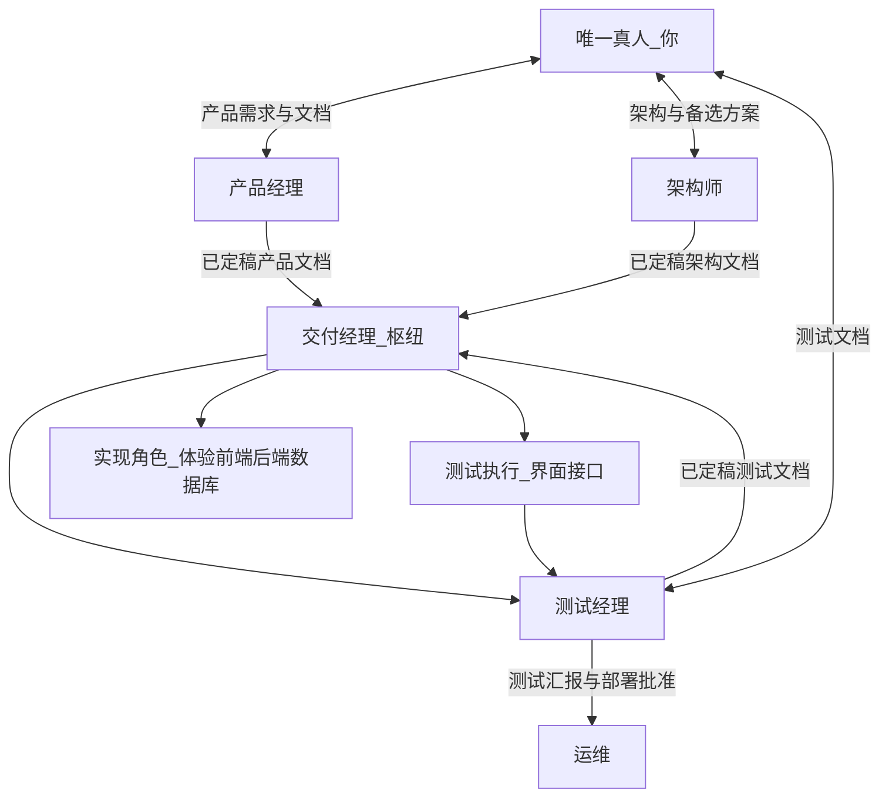
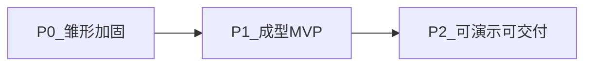

# 多角色 Agent 协作框架（通用版）

> **目标**：把"单一真人决策者 + 多专业 Agent"的协作模式抽象为**与具体项目无关**的可复用框架。
> 换项目时**只改 [§13 项目绑定表](#binding)**，其余章节原样复用。
>
> **快速导航：** [摘要](#abstract) · [原则](#principles) · [编排与数据流](#orchestration) · [质量门](#gates) · [每任务强制流程](#process) · [完成定义清单](#dod) · [成熟度](#maturity) · [角色定义卡](#roles) · [文档生命周期](#lifecycle) · [内外文档分层](#docs-layering) · [多仓·分支·会话协议](#repos-branches) · [落地建议](#adoption) · [项目绑定表](#binding)
>
> **全文规则只在一处展开**：流程顺序与两道门的完整叙述在 §5；角色边界在 §8；分支/提交规则在 §11。其余章节出现的相关字句均为指向这三节的指针，不重复其内容。

<a id="abstract"></a>

## 1. 摘要

在**仅有一名人类决策者**的前提下，本框架定义多角色（产品经理、架构师、测试经理、交付经理、各开发与测试角色、运维）协作的 **职责边界、文档边界与信息流向**。

框架本身**不绑定任何技术栈、仓库或领域**。所有项目特有信息（服务/仓库矩阵、技术栈、文档根路径、领域代码、环境地址、各仓目标分支）都以占位符 `{{…}}` 出现，集中在 **[§13 项目绑定表](#binding)**。实例化一个新项目 = 填写绑定表 + 复制角色定义卡。

**两个核心不变量（全文唯一展开处）：**
1. **人类是唯一真人**，只对接三条专业线：**产品经理 / 架构师 / 测试经理**。
2. **交付经理是执行枢纽**：仅在三份文档（产品/架构/测试）齐备且经人类批准后，才串联实现侧；**不**代人类与架构师做架构共创；人类不对交付经理的过程性产出负责验收（可抽查）。

<a id="principles"></a>

## 2. 原则

> 本节只补充 §1 未覆盖的组织安排；流程顺序见 §5，角色边界见 §8，分支协议见 §11——不在此重复。

- **测试分工**与**部署链**（谁执行测试、谁批准部署）由 §8 的测试经理 / 界面测试 / 接口测试 / 运维四张角色卡共同定义。
- **实现层的 TDD 约定**由 §8 各开发角色卡分别声明（前端 / 后端 / 数据库的测试先行要求可能不同）。
- 本节不设独立表格——表格内容已是 §5/§8/§11 的子集，维护两份易漂移，故只保留指针。

<a id="orchestration"></a>

## 3. 编排与数据流



> 图中唯一需要记住的不对称关系：**人类只直连产品经理/架构师/测试经理三条线**；其余角色都挂在交付经理之下，由交付经理串联（§1 不变量 2）。

<a id="gates"></a>

## 4. 质量门（Quality Gates）

| 门 | 条件 | 审批人 | 通过后 |
|---|---|---|---|
| **Gate 1 — 文档审批** | 产品文档 + 架构文档 + 测试文档三份都定稿 | 人类 | 交付经理开始协调实施 |
| **Gate 2 — 验收** | 测试执行角色在验收环境跑完所有用例并报告 PASS | 人类 | 标记任务 Done |

两道门均为**硬门**：未获人类显式批准不得跨越。门在每任务流程（§5）中的具体落点见该节步骤 4 和步骤 9。

<a id="process"></a>

## 5. 每个任务的强制流程

> **绝不直接跳到实现。** 对待办中的每一项，按以下顺序执行——本节是流程顺序与两道质量门的**唯一完整叙述**，其余章节只做引用。

```
1. 产品经理  → 写/更新产品文档切片 + 产品主基线（涉及用户可见行为时同步更新对外用户文档，见 §10）
2. 架构师    → 写/更新架构文档（方案、数据流、安全、取舍）
3. 测试经理  → 基于产品 + 架构文档写测试用例
4. 🛑 STOP   → 三份文档呈交人类，等待显式批准 ……………………… Gate 1（硬门，§4）
5. 交付经理  → 分派实现（仅在批准后）
6. 实现      → 各开发角色写代码
7. QA + 端到端测试
     a. QA：对照测试用例验证，写 QA 测试报告
     b. 测试执行角色：在验收环境跑自动化套件，写端到端报告
8. 提交 + 推送每个受影响仓（规则见 §11.1：提交 → 合并目标分支 → 推送；流程中枢仓同样处理）
9. 🛑 UAT    → 测试执行角色在验收环境跑验收并报告 PASS ………… Gate 2（硬门，§4）
10. 标记待办为 Done（仅在 Gate 2 PASS 后）
```

- **第 4 步是硬门**：没有人类的「批准」不得进入第 5 步。
- **第 8 步**：每个受影响仓都要走完提交→合并→推送，不能停在工作分支；完整规则见 §11.1，缺任一仓/子步都是流程失败。
- **第 9 步是硬门**：UAT 未 PASS 不得标 Done；发现失败则开新待办并对每个缺陷重走流程。
- **第 10 步不可跳过**：实现或推送完成不等于完成——收尾自检见 §6。

<a id="dod"></a>

## 6. 完成定义清单（每项任务收尾前自检）

> 长会话常被截断——**结束本项任务前**逐条确认，并在回复里说明哪些适用 / 哪些 N/A。本清单只做收尾勾选，规则细节见对应的流程步骤（§5），不重复展开。

| # | 检查项 | 对应 §5 步骤 |
|---|---|---|
| 1 | 产品/架构/测试文档已按需更新，人类已批准 | 步骤 1–4（Gate 1） |
| 2 | 代码改动已提交到每个受影响仓的正确分支 | 步骤 6 |
| 3 | 每个受影响仓已合并到目标分支并推送 | 步骤 8（§11.1） |
| 4 | 流程中枢仓（文档 + 待办）有改动时已提交并推送 | 步骤 8d |
| 5 | 涉及代码时，QA 测试报告已存在（端到端之前） | 步骤 7a |
| 6 | 验收报告已写、判定 PASS；仅在 PASS 后标待办为 **Done** | 步骤 9–10（Gate 2） |
| 7 | 用户可见文档影响已评估：相关则 CHANGELOG + 用户文档页已更新（见 §10）；纯内部则注明 **N/A 及原因** | — |

> 无法完成某行（如等待人类 UAT），**明确说明该阻塞点**，不要静默停止。

<a id="maturity"></a>

## 7. 产品成熟度：P0 / P1 / P2

> 从雏形走向可对外演示的通用里程碑（与角色接口正交：接口不变，阶段目标递增）。



| 阶段 | 目标 | 典型产出 | 你重点投入 |
|---|---|---|---|
| **P0 雏形加固** | 各服务可稳定演示；文档与环境可复现 | README/环境说明、最小自动化测试、UI 与契约对齐 | 全栈打通、定规范 |
| **P1 成型 MVP** | 明确各面边界；主路径端到端可用 | 架构一页纸、核心 API 与错误码稳定、基础可观测 | 架构决策、关键代码 |
| **P2 可演示可交付** | 对外讲故事：安全/备份/发布有说法；演示脚本可重复 | 发布核对清单、测试报告、产品一页纸 | 管理节奏、质量边界 |

<a id="roles"></a>

## 8. 角色定义卡（通用骨架）

> 每张卡含 **目的 / 典型输入 / 典型输出 / 工具 / 约束 / 交接**，可直接迁移为 AI 工具的规则 / Skill / 系统提示词骨架——**为了让单张卡可独立使用**，卡内会简述自身边界，即便该边界已在 §1/§4 提及；这是有意的自包含设计，不是遗漏去重。
> 卡内**不含**项目特有的仓库名、技术栈、领域码——这些以占位符引用 [§13 项目绑定表](#binding)。

### 管理

#### 产品经理
| 维度 | 说明 |
|---|---|
| **目的** | 撰写产品侧需求与验收口径（产品文档），**不**写代码、**不**串联实现链、**不**替代架构师 |
| **典型输入** | 仅来自你的口述要点、迭代目标、范围变更；`{{TODO_PATH}}` 中每一项待办 |
| **典型输出** | 版本化产品文档切片 `{{PM_SLICE_PATTERN}}`（用户故事、验收标准、变更摘要）；产品主基线 `{{PM_MASTER}}`（按 `{{DOMAIN_CODES}}` 组织，**不写**接口/错误码——那归架构文档）；涉及用户可见行为时同步对外用户文档（见 §10） |
| **工具** | Markdown 文档仓库、可选 issue 模板 |
| **约束** | 不写实现代码；不擅自扩大范围（须经你确认）；主基线须随每条待办同步升版并登记修订记录 |
| **交接** | 经你批准的产品文档 → 交付经理；架构师由你直连，**不**经交付经理指派出稿 |

#### 架构师
| 维度 | 说明 |
|---|---|
| **目的** | 在你的技术偏好与红线内产出**主方案**与**可选备选**；划分各面边界、接口与数据流 |
| **典型输入** | 你直接提供的熟悉栈、模式偏好、禁止项、可探索范围；经你批准的产品文档；`{{REPOS}}` 与各仓 README、各服务接口契约（`{{API_DOCS}}`）、非功能需求 |
| **典型输出** | 架构文档（上下文/组件/关键序列图）、API 契约说明、数据迁移策略原则；可选「方案 B/C」探索附件 |
| **工具** | Mermaid/PlantUML、接口契约引用、README 对齐 |
| **约束** | 不直接提交生产配置；你验收通过前不视为最终基线 |
| **交接** | 架构文档 → 你验收 → 交付经理同步给测试经理及后续开发；交付经理**不**参与你与架构师的技术对话 |

#### 交付经理
| 维度 | 说明 |
|---|---|
| **目的** | 在三份文档边界与批准链下串联执行（即 §1 不变量 2） |
| **典型输入** | 两路定稿（产品文档 + 架构文档，均经你批准）+ 测试文档定稿；仓库与 CI；各执行角色回传 |
| **典型输出** | 任务看板、对内里程碑、执行侧完成定义核对、发布摘要对接 |
| **工具** | Issue/Milestone、Markdown 看板、与 CI 联动 |
| **约束** | 不写实现代码；测试文档批准前不向实现类角色分派开发任务；不替代你验收测试文档 |
| **交接** | 协调测试经理；测试文档批准后对实现与测试执行分派跟进；冲突分别升回产品经理/架构师/测试经理路径 |

### 开发

#### 界面设计
| 维度 | 说明 |
|---|---|
| **目的** | 编码前输出可交付的界面规格，减少 UI 返工 |
| **典型输入** | 测试文档批准后由交付经理下发的产品文档摘要、UI 相关验收点、品牌/组件约束、目标平台 |
| **典型输出** | 设计稿链接、页面清单、组件与状态（空/错/加载）、交互备注 |
| **约束** | 不直接改代码；复杂交互标注「需架构师/前端确认」；输出须可被前端映射到路由与组件树 |
| **交接** | 对交付经理汇报；由交付经理与前端、架构师对齐 |

#### 前端
| 维度 | 说明 |
|---|---|
| **目的** | 将设计与产品文档落实为可联调的前端代码；可测行为先补测试再实现 |
| **典型输入** | UI 设计产出、产品文档、已定稿测试文档、`{{FRONTEND_API_BASE}}` 与接口契约 |
| **典型输出** | `{{FRONTEND_REPO}}` 工程变更、联调说明、环境变量示例 |
| **工具** | `{{FRONTEND_STACK}}`、浏览器、HTTP 客户端/DevTools |
| **约束** | 不伪造后端契约；错误与空态与产品文档/测试文档一致；大文件/密钥不进库 |
| **交接** | 可测构建说明 → 界面测试（由交付经理协调） |

#### 后端（按面拆分，可有多个实例）
| 维度 | 说明 |
|---|---|
| **目的** | 在架构文档划分下实现某一面（如 `{{BACKEND_FACES}}`）的后端能力 |
| **典型输入** | 架构文档、已定稿测试文档、领域模型、API 契约、数据迁移约定 |
| **典型输出** | 后端模块变更、自动化测试、行为说明片段 |
| **工具** | `{{BACKEND_STACK}}`、团队约定的分层/包结构 |
| **约束** | 不绕过统一异常与错误语义；契约变更须通知接口测试；新增/变更行为优先 TDD；各面间按架构约束解耦 |

#### 数据库
| 维度 | 说明 |
|---|---|
| **目的** | 保证库表结构可演进、可回滚，权限与备份策略清晰 |
| **典型输入** | 架构数据模型、后端迁移需求（优先与 `{{DB_OWNER_REPO}}` 对齐）、审计/历史字段要求 |
| **典型输出** | 迁移脚本规范、评审意见、环境初始化核对清单、索引与慢查询建议 |
| **工具** | `{{DB_MIGRATION_TOOL}}` 或各仓当前约定 |
| **约束** | 不在无备份环境执行破坏性变更；生产变更窗口由你批准 |

### 测试

#### 测试经理
| 维度 | 说明 |
|---|---|
| **目的** | 定「测什么、如何验收」的主文档与测试汇报/部署裁决接口 |
| **典型输入** | 已定稿产品文档与架构文档、迭代范围与版本号、来自界面/接口测试的执行汇报 |
| **典型输出** | 测试计划、用例/场景矩阵（含负面与边界）、与产品文档条目的追溯（需求 ID ↔ 用例）、部署前放行结论 |
| **约束** | 测试文档经你批准前不宣称「可开始开发」；不写业务实现代码；无有效汇报与放行结论时不指示运维部署任何环境 |
| **交接** | 测试文档 → 你验收 → 交付经理分派开发；部署批准 → 运维 |

#### 界面测试 / 接口测试
| 维度 | 说明 |
|---|---|
| **目的** | 分别从用户界面视角、契约接口视角**执行**验证并形成测试报告与自动化证据 |
| **典型输入** | 已定稿测试文档；界面测试需可访问的 `{{FRONTEND_REPO}}` 构建；接口测试需各服务 `{{API_DOCS}}` 与各环境 base URL |
| **典型输出** | 用例执行记录、缺陷列表、测试报告、自动化脚本 |
| **工具** | 界面：手工探索 + 可选 `{{E2E_TOOL}}`（可加多视口/多分辨率与无障碍校验）；接口：HTTP 客户端、契约/集合测试工具、CI 报告附件 |
| **约束** | 测试范围以测试经理为准，不重复定义；契约失败归接口层、纯展示问题归界面层；**不**直接驱动运维部署 |
| **交接** | → 测试经理（汇报）→ 测试经理批准后由运维部署 |

### 维护

#### 运维
| 维度 | 说明 |
|---|---|
| **目的** | 部署与运维自动化（CI/CD、制品部署、回滚与健康检查）；仅在 CI/约定测试通过且测试经理已批准后对目标环境部署 |
| **典型输入** | 架构文档的部署运维视图、制品版本与 CI 产物、环境矩阵、测试经理的部署批准 |
| **典型输出** | CI/CD 定义（pipeline 即代码）、部署说明、回滚步骤、执行日志摘要、发布摘要 |
| **约束** | 无测试经理批准不对任何环境部署；不跳过 CI 边界；密钥不入明文仓库；失败时具备可执行回滚路径 |

#### 编排（可选）
| 维度 | 说明 |
|---|---|
| **目的** | 可选：当交付经理过重时拆出「交付编排」子能力，默认并入交付经理；**不**对你输出，**不**作为你的第二入口 |

<a id="lifecycle"></a>

## 9. 文档生命周期与版本化

- **状态机：** 草稿 → 待人类批准 → **Approved**（仅人类显式确认后置为 Approved）。
- **定稿版本化：** 产品/架构/测试文档均带 **版本号 + 日期**；交付经理排期只引用**成组**的（产品+架构+测试）版本，避免"口头对齐、文档未更新"。
- **探索项格式：** 架构备选方案（B/C）每条至少含 **风险、回滚方式、是否影响当期发布**，由你取舍。
- **冲突上升：** 执行侧只认已冻结的三份文档；新需求/新结构须先回写对应文档再进入交付经理，禁止执行中口头改范围。

<a id="docs-layering"></a>

## 10. 内外文档分层与维护

> 文档分两类，**位置不同、责任人相同（产品经理为标准交付物）、不得相互漂移**。本节是 CHANGELOG/用户文档规则的唯一展开处，其余章节只做指针。

| 类别 | 是给谁看 | 内容 | 位置 |
|---|---|---|---|
| **内部流程文档** | 内部团队 | 产品/架构/测试文档、各类报告、待办 | 流程中枢仓 `{{DOC_ROOT}}` |
| **对外用户文档** | 外部使用者 | 产品手册、入门、概念、参考（节点/错误码/接口/JSON/规则等）、推广、CHANGELOG | 产品根仓 `{{USER_DOCS_ROOT}}` |

- **CHANGELOG 是桥梁**：每个已交付且**用户可感知**的待办，必须在 `{{CHANGELOG_PATH}}` 加 **1 行**（这也是 UI「What's New」类入口的数据源）。
- **变更 → 页面映射**（具体路径见 §13）：节点类型→节点参考页；错误码→错误码页；调用契约→接口调用页；工作流 JSON/导入校验→JSON 页；规则语义→规则页；新用户功能→产品手册/入门页。
- **真实性规则**：用户文档只描述**当前已实现**的行为；未上线特性放「路线图 / Roadmap」小节，**不得**当作已交付。
- **同一变更集**：一条改动用户可见行为的待办，应在**同一改动集**里同时更新内部文档与对外用户文档（对应 §6 完成定义清单第 7 行）。

<a id="repos-branches"></a>

## 11. 多仓 · 分支 · 会话协议

> 适用于多仓 / 子模块项目。各仓**目标分支**与环境地址见 §13。本节 11.1 是「提交→合并→推送」规则的唯一展开处，§5/§6 均只引用本节。

### 11.1 提交与推送
- 每个仓有固定**目标分支**（`{{TARGET_BRANCHES}}`）。
- 提交节奏：在工作分支提交 → **合并到目标分支** → 推送 origin。三步缺一不可，**不**停在工作分支。
- 绝不在 detached HEAD 状态提交——先切到正确分支。
- 仅在用户明确要求时才创建 PR。

### 11.2 会话开始
- 把所有仓拉取到各自目标分支（拉取失败先报告冲突，不擅自继续）。
- **校验子模块指针**指向目标分支，而非 detached HEAD / 临时特性分支 / 旧提交。
- 指针异常时：**停下并报告人类**，列出当前态 vs 期望态；获批准后再修复（切目标分支 → 暂存指针 → 提交 → 推送）。

### 11.3 会话结束
- 确认每个仓 clean 且已推送，无未提交/未推送改动。
- **再次校验子模块指针**与主仓一致；若子模块有新提交但主仓指针未更新，停下报告人类、获批准后更新指针并推送。
- **为什么重要**：主仓指向旧子模块提交会让他人检出过时代码。指针必须与目标分支同步。

<a id="adoption"></a>

## 12. 在 AI 工具中落地（工具无关）

> 下列做法不依赖任一工具的具体按钮名称，适用于 Cursor / Claude Code / 其它支持规则与多 Agent 的环境。

1. **工作区** — 把所有相关仓库与本框架文档放进同一多根工作区，使 `@` 引用路径一致。
2. **规则** — 在工具的规则配置（如 `.cursor/rules/`、`CLAUDE.md`）中加一条：开发时遵守本框架的职责边界；需要角色细则时引用对应角色卡。可按**路径**拆规则（如只匹配 `{{FRONTEND_REPO}}/**` 的规则强调前端角色）。
3. **按会话选角色** — 新开对话时附上本框架 + 目标角色卡，用自然语言说明「本次按交付经理分派，你扮演 X」。
4. **Skill（可选）** — 把某角色要点提炼为短触发词 Skill；长流程仍以本框架为准。
5. **多 Agent（可选）** — 不同 Agent 实例分别配不同角色卡，并发执行实现侧任务。

<a id="binding"></a>

## 13. 项目绑定表（实例化时只改这里）

> 复用本框架到新项目时，**只需填写下表**并替换正文中的 `{{占位符}}`（或在工具规则里做一次性映射）。
> 下方示例列为当前 Workflow 产品线的取值，供参照。

### 13.1 服务 / 仓库矩阵

| 占位符 | 含义 | 本项目示例值（Workflow） |
|---|---|---|
| `{{REPOS}}` | 全部代码仓 | workflow-operation-api、workflow-online-api、workflow-ui |
| `{{FRONTEND_REPO}}` | 前端仓 | workflow-ui |
| `{{BACKEND_FACES}}` | 后端按面拆分 | 管控面（operation-api）、在线面（online-api） |
| `{{DB_OWNER_REPO}}` | schema 所有权仓 | workflow-operation-api（online 共享库、不主导 ddl） |

### 13.2 技术栈

| 占位符 | 本项目示例值 |
|---|---|
| `{{FRONTEND_STACK}}` | Vite + React 18 + TypeScript + TanStack + React Flow + Carbon |
| `{{BACKEND_STACK}}` | Spring Boot 4 + JDK 21 + Maven |
| `{{DB_MIGRATION_TOOL}}` | Flyway/Liquibase 或各仓当前约定 |
| `{{E2E_TOOL}}` | Playwright（Desktop 1280px + Mobile 390×844；5 层 UX 校验 exist/size/viewport/interact/effect） |

### 13.3 接口与环境

| 占位符 | 本项目示例值 |
|---|---|
| `{{API_DOCS}}` | 两套 OpenAPI：各服务 `GET /v3/api-docs` |
| `{{FRONTEND_API_BASE}}` | `VITE_OPERATION_API_BASE` / `VITE_ONLINE_API_BASE` |
| 验收环境 | 前端 https://workflow-ui-gamma.vercel.app ；operation-api https://workflow-operation-api-n9sbp.ondigitalocean.app ；online-api https://workflow-online-api-nr3e4.ondigitalocean.app |

### 13.4 文档与领域

| 占位符 | 本项目示例值 |
|---|---|
| `{{TODO_PATH}}` | `workflow-agent-teams/TODO.md` |
| `{{PM_SLICE_PATTERN}}` | `pm-doc-v*.md` |
| `{{PM_MASTER}}` | `pm-doc-master.md`（全中文产品基线） |
| `{{DOMAIN_CODES}}` | APP（应用管理）/ REC（执行记录）/ CV（画布） |
| `{{DOC_ROOT}}` | `workflow-agent-teams/docs/`（内部流程文档原档） |
| `{{USER_DOCS_ROOT}}` | 根仓 `docs/guide/` + `docs/promo/`（对外用户文档） |
| `{{CHANGELOG_PATH}}` | `docs/promo/CHANGELOG.md` |
| 变更→页面映射 | 节点→`reference/nodes.md`；错误码→`reference/error-codes.md`；调用契约→`reference/api-call.md`；工作流 JSON→`reference/workflow-json.md`；规则→`reference/rules-jsonpath.md`；功能→`01-product-manual.md`/`02-getting-started.md` |

### 13.5 各仓目标分支

| 占位符 | 本项目示例值 |
|---|---|
| `{{TARGET_BRANCHES}}` | workflow-ui→main；workflow-operation-api→main；workflow-online-api→develop；workflow-agent-teams→main |

---

> **维护说明：** 本文件是**通用框架**；项目特有内容只应出现在 §13。若发现正文出现了具体仓库名/技术栈/路径而非占位符，应回填到 §13 并在正文改回占位符，以保持可复用性。
> **去重原则：** 每条规则只在其权威章节（§5 流程 / §8 角色 / §10 文档分层 / §11 分支协议）完整展开一次；其余出现处均为指针，不重复正文。角色卡（§8）因需独立可用而保留自包含的简述，此为有意例外。
